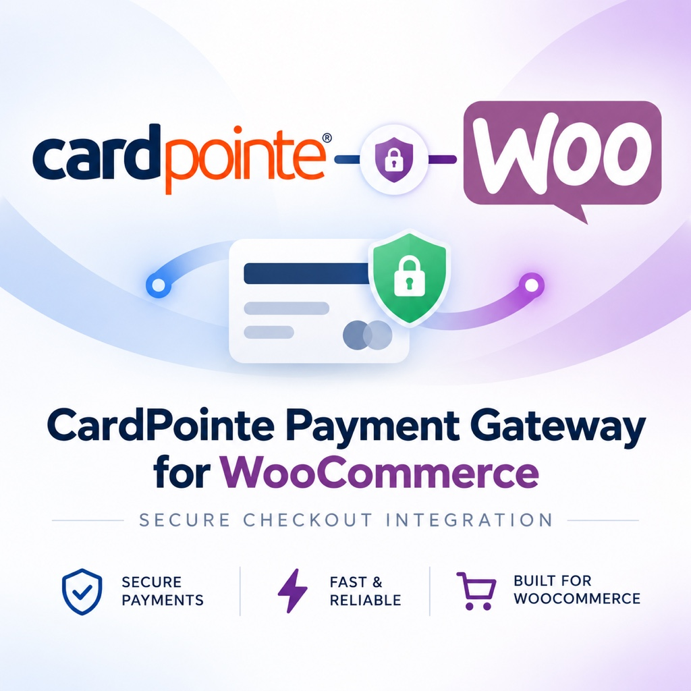

  

# Paradox CardPointe Gateway for WooCommerce

WooCommerce payment gateway for [CardPointe](https://cardpointe.com) (Fiserv / CardConnect) by [Paradox Solutions](https://paradoxsolutions.io).

Card and bank account details are entered in CardPointe's Hosted iFrame Tokenizer and tokenized by CardSecure, so no card data ever touches your server.

## Features

- Charge immediately or authorize now and capture later (order screen, order actions, or automatic on status change)
- Accepted card type enforcement via the CardPointe BIN service
- Full and partial refunds from the WooCommerce order screen (voids unsettled transactions automatically)
- Optional gateway receipts on order pages and emails
- Redacted request/response logging
- Apple Pay: express buttons on product pages, cart and checkout plus a button in the credit card box, each toggleable; classic pages, Cart/Checkout blocks and CheckoutWC; Safari natively and Chrome/Edge/Firefox via Apple's SDK; tokens are decrypted by CardSecure, never on the server
- Saved cards and bank accounts backed by CardPointe profiles
- WooCommerce Subscriptions and WooCommerce Pre-Orders support
- eCheck (ACH) as a separate payment method
- Classic checkout and Cart/Checkout Blocks, HPOS compatible
- Separate sandbox and production credentials with a "Test connection" button

## Requirements

- WordPress 6.6+, PHP 7.4+
- WooCommerce 9.0+
- A CardPointe merchant account with API credentials (site name, merchant ID, API username/password)

## Installation

1. Download this repository as a ZIP (or clone it into `wp-content/plugins/paradox-cardpointe-gateway-for-woocommerce`).
2. Activate **Paradox CardPointe Gateway for WooCommerce** under Plugins.
3. Go to WooCommerce → Settings → Payments → **CardPointe - Credit Card**, enter your credentials, and click **Test connection**.
4. Enable the gateway. Turn off sandbox mode when you are ready to go live (production requires HTTPS at checkout).
5. Optionally enable **CardPointe - eCheck (ACH)** if your merchant ID supports ACH.

See `readme.txt` for the full WordPress.org style documentation and FAQ.

## License

GPL-3.0-or-later. See `LICENSE`.
